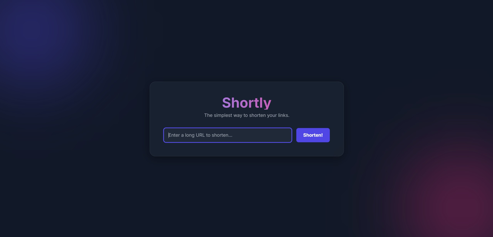

# Shortly: A Cloud-Native URL Shortener on Kubernetes



## 🚀 Project Overview

**Shortly** is a fully functional URL shortening microservice application built from the ground up and deployed on Microsoft Azure. This project demonstrates a comprehensive, hands-on understanding of modern cloud engineering and DevOps principles, including containerization, Kubernetes orchestration, microservice architecture, and cloud networking.

The application is composed of three core, decoupled services:
1.  **Frontend Service:** A Python Flask and JavaScript single-page application (SPA) featuring GSAP animations that provides the user interface for creating and viewing shortened links.
2.  **Backend API Service:** A Python Flask API that handles the core logic for generating unique short codes, storing URL mappings, and retrieving them for redirection.
3.  **Database Service:** A Redis instance for high-performance, in-memory storage of URL mappings, ensuring fast lookups and redirects.

All services are deployed as versioned containers within an Azure Kubernetes Service (AKS) cluster and are exposed to the internet through a single, robust NGINX Ingress controller.

---

## 🏗️ Technical Architecture

This project utilizes a modern, cloud-native architecture designed for scalability, resilience, and maintainability. The infrastructure is fully defined through declarative YAML manifests.

### Cloud Deployment Architecture (Azure)

This diagram illustrates the flow of traffic from a user's browser through the Azure cloud infrastructure to the appropriate microservice.


*(**Action:** Create this diagram in draw.io, export it as a PNG, upload it to a service like Imgur, and replace this link!)*

**What to include in the diagram:**
* A "User" icon outside the cloud.
* An arrow to the "NGINX Ingress Controller" (with its Public IP).
* The Ingress routing traffic based on the path:
    * `/` requests go to the `Frontend Service`.
    * `/api` requests go to the `Backend Service`.
* Boxes for the `Frontend Pods`, `Backend Pod`, and `Redis Pod` inside the AKS Cluster.
* Show the `Backend Service` communicating with the `Redis Service`.

### Local Development Architecture (Docker Compose)

This diagram shows how the same containerized services are run locally for development and testing using Docker Compose.


*(**Action:** Create this diagram in draw.io and replace this link!)*

**What to include in the diagram:**
* A box for "Your Local Machine".
* Inside, show the Browser accessing `localhost:8080`.
* Show a `Docker Network`.
* Inside the network, have three boxes: `Frontend Container`, `Backend Container`, and `Redis Container`.
* Show the `Frontend Container` communicating with the `Backend Container` over the Docker Network.
* Show the `Backend Container` communicating with the `Redis Container`.

---

## 🛠️ Tech Stack & Key Concepts

| Category | Technology / Concept |
| :--- | :--- |
| **Cloud Provider** | Microsoft Azure |
| **Containerization** | Docker, Docker Compose |
| **Orchestration** | Azure Kubernetes Service (AKS) |
| **Container Registry** | Azure Container Registry (ACR) |
| **Networking** | NGINX Ingress Controller, Kubernetes Services |
| **Backend** | Python, Flask, Redis |
| **Frontend** | Python, Flask, JavaScript, HTML/CSS, GSAP |
| **Deployment** | Declarative YAML, `kubectl`, Helm |
| **CI/CD** | Local build/push workflow using Docker & Azure CLI |

---

## 🌟 Key Features & Skills Demonstrated

* **Microservice Architecture:** Successfully designed and deployed a decoupled application, allowing for independent scaling and development of the frontend and backend.
* **Containerization with Docker:** Wrote custom `Dockerfile`s for each service, demonstrating the ability to package applications into portable and reproducible container images.
* **Kubernetes Deployment & Management:** Deployed and managed all services on AKS using declarative YAML manifest files, showcasing proficiency in `Deployments`, `Services`, and `Ingress`.
* **Advanced Networking with Ingress:** Implemented an industry-standard NGINX Ingress controller to manage all external traffic, intelligently routing requests to the appropriate microservice based on the URL path.
* **Cloud Infrastructure Provisioning:** All necessary Azure resources, including the AKS cluster and ACR, were provisioned and configured from scratch using the Azure Portal and CLI.
* **Real-World Problem Solving:** Diagnosed and resolved a wide range of complex, real-world issues, including:
    * Azure subscription limitations (VM sizes, availability zones, addon restrictions).
    * Container image pull permissions (`ImagePullBackOff`).
    * Complex Ingress routing bugs (404 errors, path rewriting, static file serving).
    * Cross-Origin Resource Sharing (CORS) errors between services.

---

## ⚙️ How to Run

The entire application state is defined in code and YAML manifests within this repository.

### Local Development (Docker Compose)
1.  Ensure Docker Desktop is running.
2.  Navigate to the project's root directory.
3.  Run `docker-compose up --build`.
4.  Access the application at `http://localhost:8080`.

### Cloud Deployment (Azure)
1.  Provision an Azure Resource Group, ACR, and AKS cluster.
2.  Build and push the `frontend` and `backend` Docker images to your ACR.
3.  Install the NGINX Ingress Controller via Helm.
4.  Update the image paths in the `-deployment.yaml` files to point to your ACR.
5.  Apply all the YAML manifests to the cluster:
    ```bash
    kubectl apply -f redis-deployment.yaml
    kubectl apply -f backend-deployment.yaml
    kubectl apply -f frontend-deployment.yaml
    kubectl apply -f ingress.yaml
    ```
6.  Get the public IP address of the Ingress and access the application in your browser:
    ```bash
    kubectl get ingress
    ```

---

## 📈 Project Status

The application is fully functional. Future improvements could include:
* Adding a custom domain name and TLS certificate.
* Implementing a full CI/CD pipeline with GitHub Actions to automate the build and deploy process.
* Adding analytics to track link clicks.
* Persisting Redis data to a volume to survive pod restarts.
